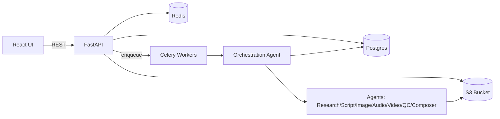
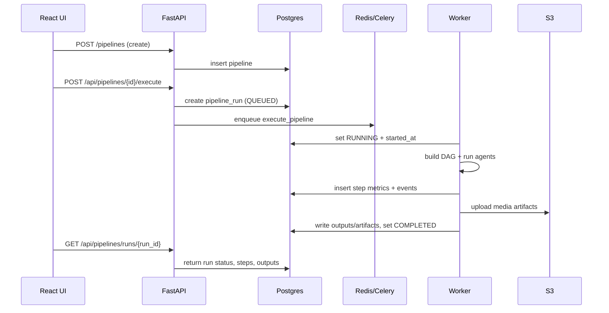

# PROJECT_INFO

## High-Level Design (HLD)

### Purpose
Content Automation AI creates, executes, and tracks content generation pipelines. It supports text, image, audio, and video outputs with asynchronous execution, observability, and asset storage.

### Key Capabilities
- Pipeline CRUD (create/update/delete)
- Pipeline execution with agent orchestration (DAG)
- Step-by-step execution tracking and logs
- Output persistence (DB + S3 for media)
- Auth and rate limiting

---

## Architecture Overview

### Components
- **Frontend (React/Vite)**: Pipeline creation, execution monitoring, content editor
- **API (FastAPI)**: Auth, pipeline CRUD, asset handling, execution endpoints
- **Orchestration**: DAG-based execution and state machine
- **Workers (Celery)**: Asynchronous pipeline runs
- **Storage**:
  - **Postgres**: Pipelines, runs, steps, events, outputs
  - **S3**: Media artifacts (images/audio/video)
- **Redis**: Celery broker and rate limiting

### Data Stores
- **pipelines**: User-defined pipeline configuration
- **pipeline_runs**: Run state and outputs
- **pipeline_run_steps**: Step/agent status
- **pipeline_events**: Execution logs
- **pipeline_assets**: Reference uploads

---

## System Architecture Diagram



---

## Execution Flow Diagram



---

## Storage Design (S3)

```
users/{user_id}/pipelines/{pipeline_id}/runs/{run_id}/
  text/
    script.json
    captions.vtt
  images/
    img_001.png
  audio/
    voiceover.mp3
  video/
    final.mp4
  metadata/
    outputs_manifest.json
```

---

## Frontend Flow (No UI/UX changes)

- **CreatePipelineModal**: Collects pipeline configuration and video provider fields when content type = Video
- **ContentEditor**: Polls run status/outputs/logs and renders latest pipeline state

---

## Known Gaps / Issues (Non-blocking)

1. **Video providers are async** (Replicate/Runway/ComfyUI). Current integration assumes immediate URL. Needs polling/webhook flow to finalize video URL.
2. **Posting to platforms** is not implemented (DAG POST node is placeholder).
3. **Error details** are written to DB but should also be surfaced in UI for clarity.
4. **API keys** must be set for OpenAI/Anthropic/Replicate/Runway to avoid fallbacks.
5. **ComfyUI workflow** requires a proper workflow JSON (current is minimal stub).

---

## Critical Paths

1. Pipeline CRUD works (auth required)
2. Execute pipeline enqueues Celery
3. Worker executes DAG, writes steps/events/outputs
4. UI polls and renders updates

---

## Security/Access Notes

- Auth required for all pipeline routes
- API tokens stored in server env
- Media stored in S3 under user/pipeline/run paths

---

## Key Files

- API routes: [app/routes/pipeline_routes.py](app/routes/pipeline_routes.py), [app/routes/pipeline_execution_routes.py](app/routes/pipeline_execution_routes.py)
- Orchestration: [app/orchestration/orchestration_agent.py](app/orchestration/orchestration_agent.py), [app/orchestration/dag.py](app/orchestration/dag.py)
- Agents: [app/agents/content/content_agents.py](app/agents/content/content_agents.py), [app/agents/quality/quality_check_agent.py](app/agents/quality/quality_check_agent.py), [app/agents/composer/composer_agent.py](app/agents/composer/composer_agent.py)
- Video providers: [app/agents/video](app/agents/video)
- DB models: [app/models/pipeline.py](app/models/pipeline.py), [app/models/execution.py](app/models/execution.py)
- Worker: [app/celery_config/pipeline_tasks.py](app/celery_config/pipeline_tasks.py)
